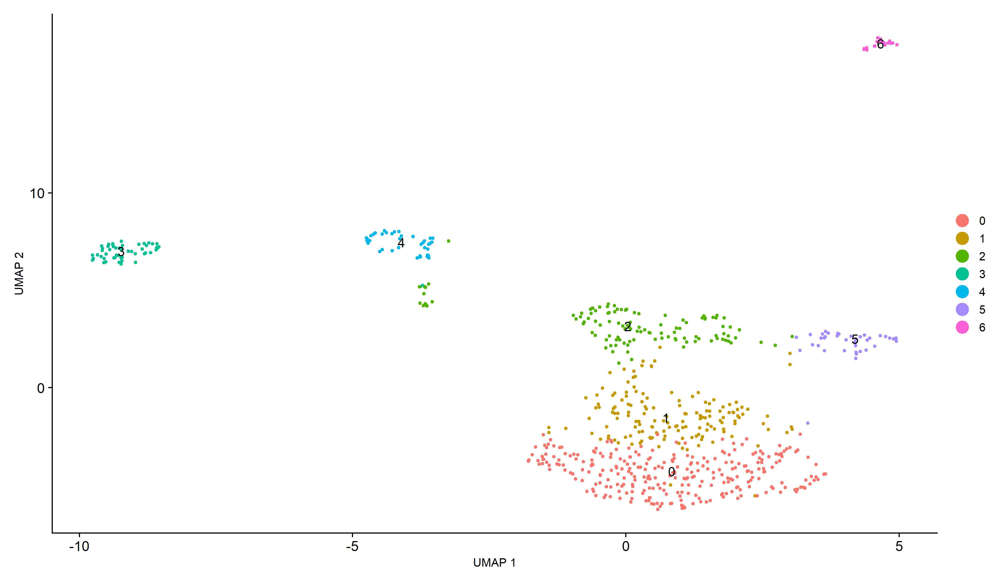

# Single-cell RNA-seq Clustering 

This project is a single-cell RNA-seq (scRNA-seq) analysis workflow in R using the Seurat package. The input dataset, E-MTAB-10596, was downloaded from the Single Cell Expression Atlas and contains filtered count matrices in Matrix Market format.

### Workflow Steps

1. **Data download and import**

   * Downloaded count matrix and metadata via `wget`
   * Created a Seurat object from `.mtx`, `.cols`, and `.rows` files

2. **Quality control and filtering**

   * Inspected `nCount_RNA` and `nFeature_RNA`
   * Filtered cells to remove low-quality data

3. **Preprocessing**

   * Normalization: `LogNormalize`
   * Feature selection: top 2000 variable genes
   * Scaling and centering of all genes

4. **Dimensionality reduction**

   * PCA to reduce noise
   * UMAP for visualization (see below)

5. **Clustering and marker detection**

   * Clustering via shared nearest neighbor (SNN)
   * Identified marker genes for each cluster with `FindAllMarkers`
   * Plotted a heatmap of top 10 markers per cluster

### Output

The final UMAP shows **7 distinct clusters** of cells (0–6), colored and labeled. Clustering was based on expression patterns across variable genes. The structure suggests biologically meaningful subpopulations (different cell types or states).

## Interpretation

* The UMAP clearly separates clusters, indicating well-structured transcriptional differences.
* The number and separation of clusters depend on the quality filtering and `resolution` parameter in clustering.
* Marker genes were detected for each cluster based on differential expression, filtered by log-fold change, and visualized via heatmap. However, cluster annotation was not performed in this workflow.
* 
## Requirements

* R + Seurat
* Matrix Market input files
* Optional: `patchwork`, `org.Hs.eg.db`, `ggplot2`, `dplyr`, `BiocManager`, `remotes`, `Signac`

  | File/Folder           | Description                                                                                      |
| --------------------- | ------------------------------------------------------------------------------------------------ |
| `scRNAseq_workflow.R` | R script containing the full Seurat analysis pipeline                                            |
| `umap.jpeg`  | UMAP plot showing the final clustering result                                                    |
| `Seurat_Vracar_1.rds` | Saved Seurat object containing the processed dataset                                             |
| `Raw_files/E-MTAB-10596.*`      | Input count matrix files downloaded from the Single Cell Expression Atlas (Matrix Market format) |

